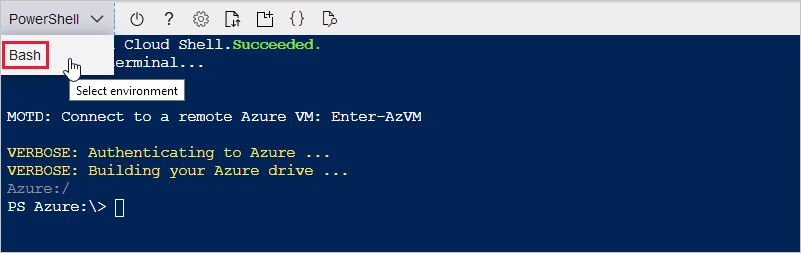
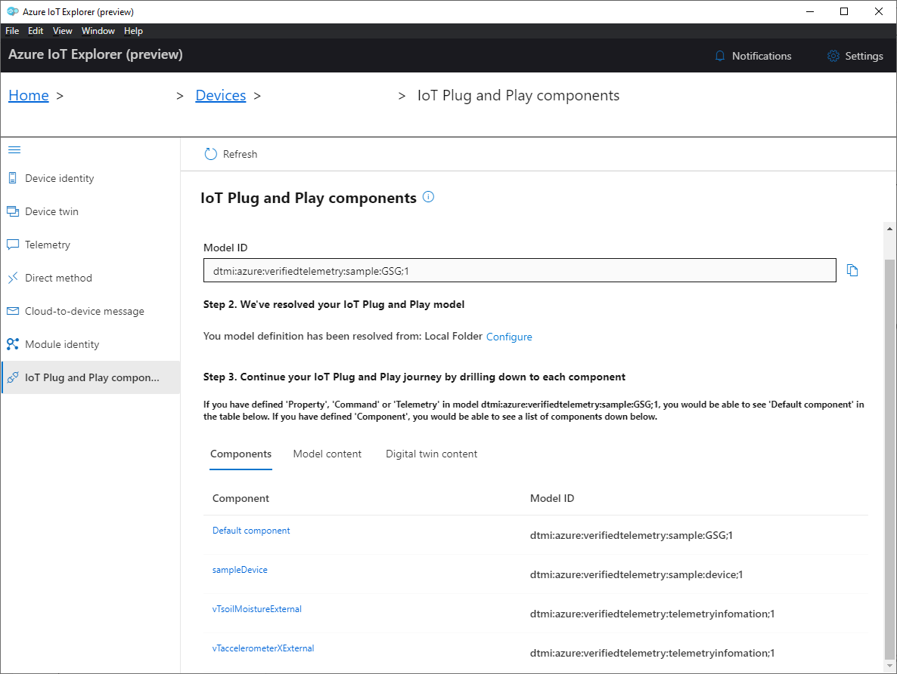
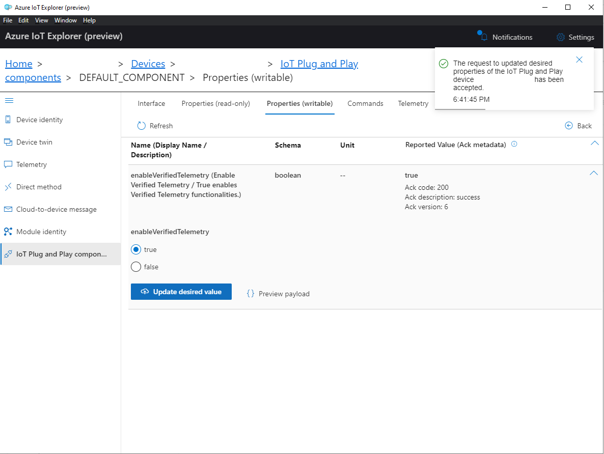
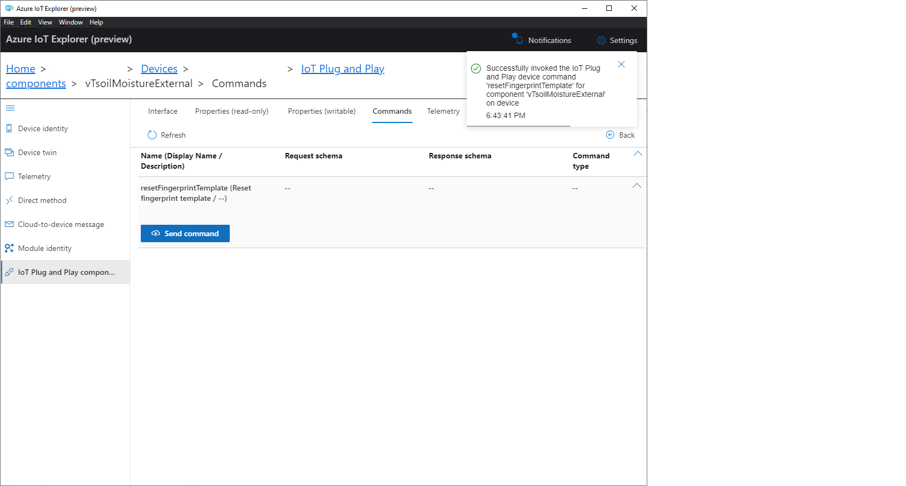
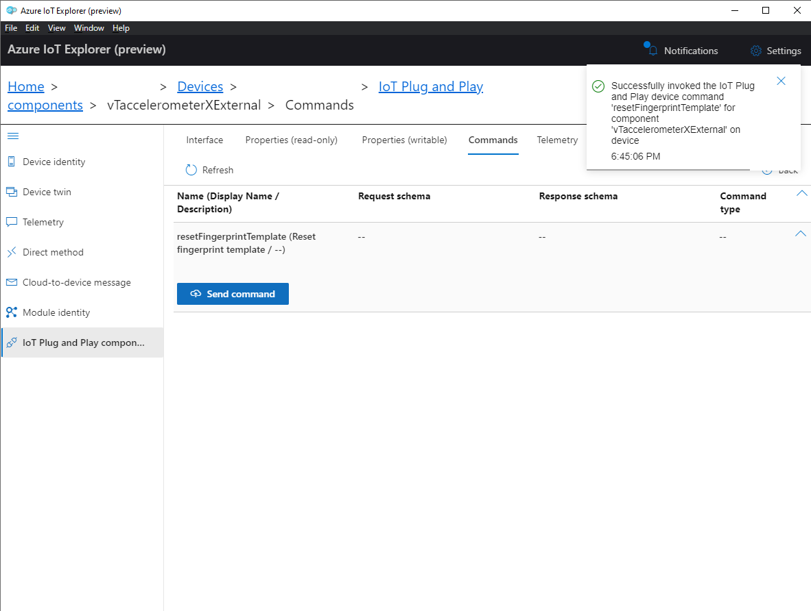
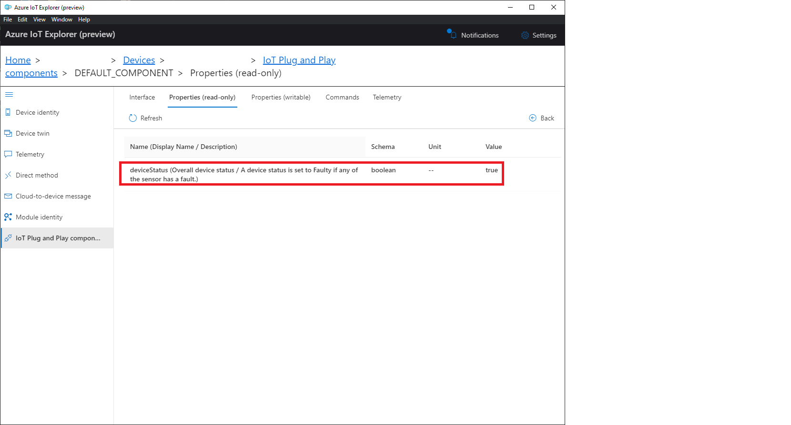
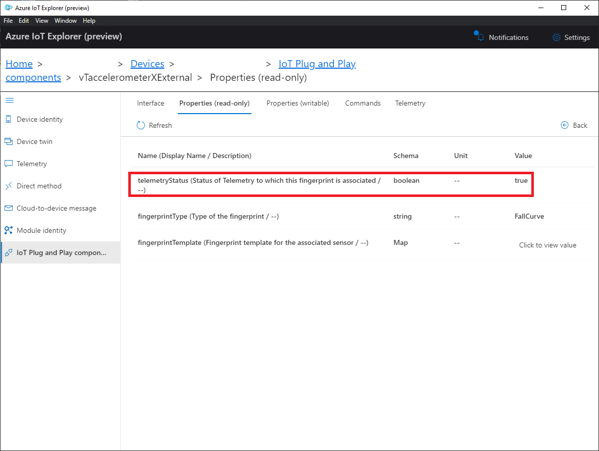
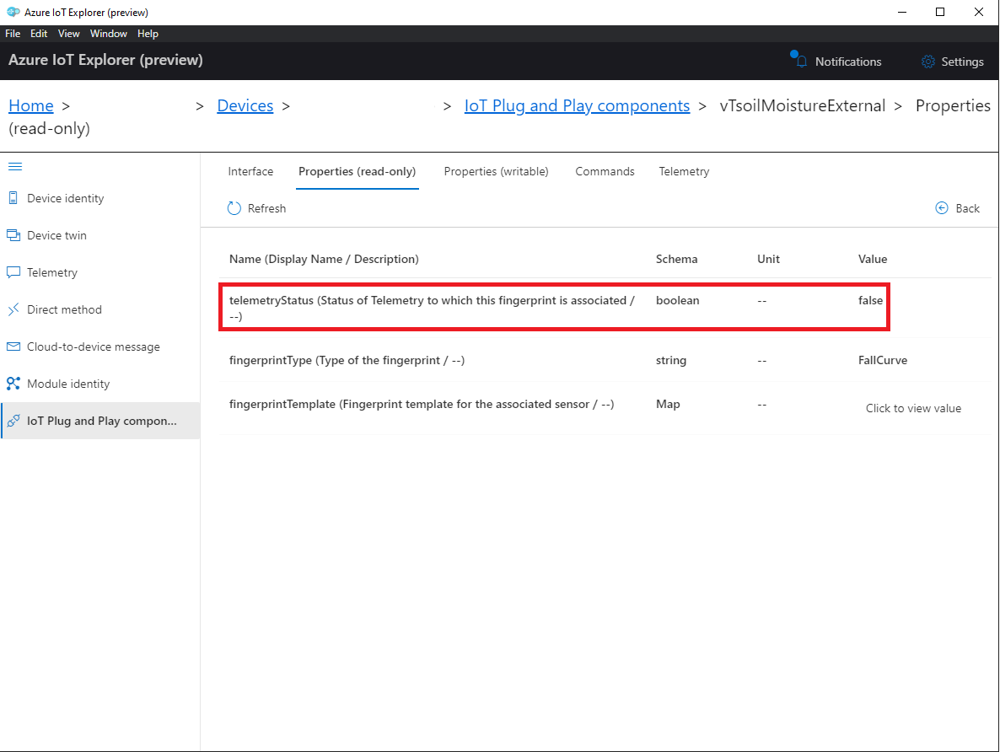

# Getting started with the STMicroelectronics B-L475E-IOT01A / B-L4S5I-IOTOA1 Discovery kits for Verified Telemetry

## Prerequisites

* A PC running Microsoft Windows (Windows 10 recommended)
* If you don't have an Azure subscription, [create one for free](https://azure.microsoft.com/free/?WT.mc_id=A261C142F) before you begin.
* [Git](https://git-scm.com/downloads)
* Hardware

    > * STM DevKit. The tutorial works with either of the following STM Discovery kits.
    >   * [B-L475E-IOT01A](https://www.st.com/en/evaluation-tools/b-l475e-iot01a.html)
    >   * [B-L4S5I-IOT01A](https://www.st.com/en/evaluation-tools/b-l4s5i-iot01a.html)
    > * Wi-Fi 2.4 GHz
    > * USB 2.0 A male to Micro USB male cable
    > * [Analog Accelerometer ADXL335](https://www.sparkfun.com/products/9269)
    > * [Soil Moisture Sensor](https://www.dfrobot.com/product-1385.html)

## Prepare the development environment

To set up your development environment, first you clone a GitHub repo that contains all the assets you need for the tutorial. Then you install a set of programming tools.

### Clone the repo for the tutorial

Clone the following repo to download all sample device code, setup scripts, and offline versions of the documentation.
To clone the repo, run the following command:

```shell
git clone --recursive https://github.com/Azure/Verified-Telemetry-Device-Sample.git
```

### Install the tools

The cloned repo contains a setup script that installs and configures the required tools. If you installed these tools in another tutorial in the getting started guide, you don't need to do it again.

> Note: The setup script installs the following tools:
> * [GCC](https://developer.arm.com/tools-and-software/open-source-software/developer-tools/gnu-toolchain/gnu-rm): Compile
> * [CMake](https://cmake.org): Build
> * [Termite](https://www.compuphase.com/software_termite.htm): Monitor COM port output for connected devices
> * [Azure IoT Explorer](https://github.com/Azure/azure-iot-explorer/releases): Cross-platform utility to  monitor and manage Azure IoT resources

To run the setup script:

1. From File Explorer, navigate to the following path in the repo and run the setup script named *get-toolchain.bat*:

    > *getting-started\tools\get-toolchain.bat*

    After the installation completes, the Azure IoT Explorer opens automatically. Keep the IoT Explorer open, you'll use it in later steps.

1. After the installation, open a new console window to recognize the configuration changes made by the setup script. Use this console to complete the remaining programming tasks in the tutorial. You can use Windows CMD, PowerShell, or Git Bash for Windows.
1. Run the following code to confirm that CMake version 3.14 or later is installed.

    ```shell
    cmake --version
    ```

## Prepare Azure resources

To prepare Azure cloud resources and connect a device to Azure, you can use Azure CLI. There are two ways to access the Azure CLI: by using the Azure Cloud Shell, or by installing Azure CLI locally.  Azure Cloud Shell lets you run the CLI in a browser so you don't have to install anything.

Use one of the following options to run Azure CLI.  

If you prefer to run Azure CLI locally:

1. If you already have Azure CLI installed locally, run `az --version` to check the version. This tutorial requires Azure CLI 2.10.1 or later.
1. To install or upgrade, see [Install Azure CLI](https://docs.microsoft.com/cli/azure/install-azure-cli?view=azure-cli-latest). If you install Azure CLI locally, you can run CLI commands in the GCC Command Prompt, Git Bash for Windows, or PowerShell.

If you prefer to run Azure CLI in the browser-based Azure Cloud Shell:

1. Use your Azure account credentials to sign into the Azure Cloud shell at https://shell.azure.com/.
    > Note: If this is the first time you've used the Cloud Shell, it prompts you to create storage, which is required to use the Cloud Shell.  Select a subscription to create a storage account and Microsoft Azure Files share.
1. Select Bash or PowerShell as your preferred CLI environment in the **Select environment** dropdown. If you plan to use Azure Cloud Shell, keep your browser open to run the Azure CLI commands in this tutorial.

    

### Create an IoT hub

You can use Azure CLI to create an IoT hub that handles events and messaging for your device.

To create an IoT hub:

1. In your CLI console, run the [az extension add](https://docs.microsoft.com/cli/azure/extension?view=azure-cli-latest#az-extension-add) command to add the Microsoft Azure IoT Extension for Azure CLI to your CLI shell. The IOT Extension adds IoT Hub, IoT Edge, and IoT Device Provisioning Service (DPS) specific commands to Azure CLI.

   ```shell
   az extension add --name azure-iot
   ```

1. Run the [az group create](https://docs.microsoft.com/cli/azure/group?view=azure-cli-latest#az-group-create) command to create a resource group. The following command creates a resource group named *MyResourceGroup* in the *centralus* region.

    > Note: You can optionally set an alternate `location`. To see available locations, run [az account list-locations](https://docs.microsoft.com/cli/azure/account?view=azure-cli-latest#az-account-list-locations). For this tutorial we recommend using `centralus` as in the example CLI command. The IoT Plug and Play feature that you use later in the tutorial, is currently only available in three regions, including `centralus`.

    ```shell
    az group create --name MyResourceGroup --location centralus
    ```

1. Run the [az iot hub create](https://docs.microsoft.com/cli/azure/iot/hub?view=azure-cli-latest#az-iot-hub-create) command to create an IoT hub. It might take a few minutes to create an IoT hub.

    *YourIotHubName*. Replace this placeholder below with the name you chose for your IoT hub. An IoT hub name must be globally unique in Azure. This placeholder is used in the rest of this tutorial to represent your unique IoT hub name.

    ```shell
    az iot hub create --resource-group MyResourceGroup --name {YourIoTHubName}
    ```

1. After the IoT hub is created, view the JSON output in the console, and copy the `hostName` value to a safe place. You use this value in a later step. The `hostName` value looks like the following example:

    `{Your IoT hub name}.azure-devices.net`

### Register a device

In this section, you create a new device instance and register it with the IoT hub you created. You will use the connection information for the newly registered device to securely connect your physical device in a later section.

To register a device:

1. In your console, run the [az iot hub device-identity create](https://docs.microsoft.com/cli/azure/ext/azure-cli-iot-ext/iot/hub/device-identity?view=azure-cli-latest#ext-azure-cli-iot-ext-az-iot-hub-device-identity-create) command. This creates the simulated device identity.

    *YourIotHubName*. Replace this placeholder below with the name you chose for your IoT hub.

    *MySTMDevice*. You can use this name directly for the device in CLI commands in this tutorial. Optionally, use a different name.

    ```shell
    az iot hub device-identity create --device-id MyMXChipDevice --hub-name {YourIoTHubName}
    ```

1. After the device is created, view the JSON output in the console, and copy the `deviceId` and `primaryKey` values to use in a later step.

Confirm that you have the copied the following values from the JSON output to use in the next section:

> * `hostName`
> * `deviceId`
> * `primaryKey`

## Prepare the device

To connect the STM DevKit to Azure, you'll modify a configuration file for Wi-Fi and Azure IoT settings, rebuild the image, and flash the image to the device.

### Add configuration

1. In a text editor, edit the file *getting-started\STMicroelectronics\STM32L4_L4+\app\azure_config.h* to set the Wi-Fi constants to the following values from your local environment.

    |Constant name|Value|
    |-------------|-----|
    |`WIFI_SSID` |{*Your Wi-Fi ssid*}|
    |`WIFI_PASSWORD` |{*Your Wi-Fi password*}|
    |`WIFI_MODE` |{*One of the enumerated Wi-Fi mode values in the file.*}|

1. Edit the same file to set the Azure IoT device information constants to the values that you saved after you created Azure resources.

    |Constant name|Value|
    |-------------|-----|
    |`IOT_HUB_HOSTNAME` |{*Your Iot hub hostName value*}|
    |`IOT_DEVICE_ID` |{*Your deviceID value*}|
    |`IOT_PRIMARY_KEY` |{*Your primaryKey value*}|

### Build the image

In your console or in File Explorer, run the script *rebuild.bat* at the following path to build the image:

> *getting-started\STMicroelectronics\STM32L4_L4+\tools\rebuild.bat*

After the build completes, confirm that two binary files were created. There's a binary image for each version of the STM Devkit. The build saves the images to the following paths:

> *getting-started\STMicroelectronics\STM32L4_L4+\build\app\stm32l475_azure_iot.bin*

> *getting-started\STMicroelectronics\STM32L4_L4+\build\app\stm32l4S5_azure_iot.bin*

### Flash the image

1. On the STM DevKit MCU, locate the **Reset** button, the Micro USB port which is labeled **USB STLink**, and the board part number. You will refer to these items in the next steps. All of them are highlighted in the following picture:

    

1. Use the Micro USB cable to connect the **USB STLink** port on the STM DevKit to your computer.
    > Note: For detailed setup information about the STM DevKit, see the instructions on the packaging, or see [B-L475E-IOT01A Resources](https://www.st.com/en/evaluation-tools/b-l475e-iot01a.html#resource) / [B-L4S5I-IOT01A Resources](https://www.st.com/en/evaluation-tools/b-l4s5i-iot01a.html#resource).
1. In File Explorer, find the binary files that you created in the previous section.
1. Copy the binary file whose file name corresponds to the part number of the STM Devkit you are using. For example, if your board part number is **B-L475E-IOT01A1**, copy the binary file named *stm32l475_azure_iot.bin*.
1. In File Explorer, find the STM Devkit that's connected to your computer. The device appears as a drive on your system with the drive label **DIS_L4IOT**.
1. Paste the binary file into the root folder of the STM Devkit. Flashing starts automatically and completes in a few seconds.

    > Note: During the flashing process, a LED rapidly toggles between red and green on the STM DevKit.

### Connect Sensors         ***Verified Telemetry***

Refer to the table and image below to connect the two sensors: [ADXL335](https://www.sparkfun.com/products/9269) & [Soil Moisture](https://www.dfrobot.com/product-1385.html)

| Sensor Name   | Sensor Pin           | MCU Pin | Devkit Pin |
|---------------|----------------------|-----------------------------|------------|
| ADXL335       | X Axis analog output | PC1                           | A4        |
| ADXL335       | VCC                  | PB8                           | D15       |
| ADXL335       | GND                  | GND                           | GND       |
| Soil Moisture | Analog Out           | PC0                           | A5        |
| Soil Moisture | VCC                  | PB9                          | D14        |
| Soil Moisture | GND                  | GND                          | GND        |


### Confirm device connection details

You can use the **Termite** utility to monitor communication and confirm that your device is set up correctly.
> Note: If you have issues getting your device to initialize or connect after flashing, see [Troubleshooting](../../docs/troubleshooting.md).

1. Start **Termite**.
1. Select **Settings**.
1. In the **Serial port settings** dialog, check the following settings and update if needed:
    * **Baud rate**: 115,200
    * **Port**: The port that your STM DevKit is connected to. If there are multiple port options in the dropdown, you can find the correct port to use. Open Windows **Device Manager**, and view **Ports** to identify which port to use.

    
1. Select OK.
1. Press the **Reset** button on the device. The button is black and is labeled on the device.
1. In the **Termite** console, check the following checkpoint values to confirm that the device is initialized and connected to Azure IoT.

    |Checkpoint name|Output value|
    |---------------|-----|
    |DHCP |SUCCESS: DHCP initialized|
    |DNS |SUCCESS: DNS client initialized|
    |SNTP |SUCCESS: SNTP initialized|
    |MQTT |SUCCESS: MQTT client initialized|

    The Termite console shows the details about the device, your connection, and the checkpoint values.

    ```output
    Initializing DHCP
        IP address: 192.168.1.131
        Gateway: 192.168.1.1
    SUCCESS: DHCP initialized

    Initializing DNS client
        DNS address: 192.168.1.1
    SUCCESS: DNS client initialized

    Initializing SNTP client
    SNTP time update: May 15, 2020 14:43:16.228 UTC
    SUCCESS: SNTP initialized

    Initializing MQTT client
    SUCCESS: MQTT client initialized

    Time 1589553799
    Starting MQTT thread
    Sending device twin update with float value
    Sending message {"temperature": 29.97}
    ```

    > **Important**: If the DNS client initialization fails and notifies you that the Wi-Fi firmware is out of date, you'll need to update the Wi-Fi module firmware. Download and install the [Inventek ISM 43362 Wi-Fi module firmware update](https://www.st.com/resource/en/utilities/inventek_fw_updater.zip). Then press the **Reset** button on the device to recheck your connection, and continue this tutorial.

Keep Termite open to monitor device output in subsequent steps.

## Setup Azure IoT Hub details in Azure IoT Explorer


To add a connection to your IoT hub:

1. In your CLI console, run the [az iot hub show-connection-string](https://docs.microsoft.com/en-us/cli/azure/iot/hub?view=azure-cli-latest#az-iot-hub-show-connection-string) command to get the connection string for your IoT hub.

    ```shell
    az iot hub show-connection-string --name {YourIoTHubName}
    ```

1. Copy the connection string without the surrounding quotation characters.
1. In Azure IoT Explorer, select **IoT hubs > Add connection**.
1. Paste the connection string into the **Connection string** box.
1. Select **Save**.

    

If the connection succeeds, the Azure IoT Explorer switches to a **Devices** view and lists your device.

## Add PnP Model Files  ***Verified Telemetry***

To add a device model to IoT Explorer:

1. Navigate to **Home**.
1. Select **IoT Plug and Play Settings**.
1. Select **Add > Local folder**.
1. Select **Pick a folder**.
1. Browse to */verified-telemetry-device-sample/core/model/*. The folder contains the Verified Telemetry Interface and sample model files.
1. Click **Select**.
1. Select **Save**.

    

## Access the IoT Plug and Play components ***Verified Telemetry***

To access the IoT Plug and Play components on your device:

1. Select **IoT hubs > View devices in this hub**.
1. Select your device.
1. Select **IoT Plug and Play components**.

    

## Sample Device component  ***Verified Telemetry***

The [Device Sensors Interface](../../core/model/sample/device.json) contains telemetries, properties and commands for the demo device.

| Tab | Type | Name | Description |
|---|---|---|---|
| **Interface** | Interface | `Sample Device` | Example standard Device Model for getting started with Verified Telemetry/Dependable IoT Guide |
| **Properties (read-only)** | Property | `ledState` | The current state of the LED |
| **Commands** | Command | `setLedState` | Enable or disable the LED |
| **Telemetry** | Telemetry | `soilMoistureExternal`, `accelerometerXExternal`, `temperature`, `pressure`, `humidityPercentage`, `acceleration`, `magnetic` | Telemetries originating from various onboard and external sensors |

### View Telemetry from Device component ***Verified Telemetry***

To view telemetry from Sample Device component:

1. Select the **Telemetry** tab.
1. Select **Start**.  IoT Explorer displays telemetry using the interval set in device code.

    ```json
    6:50:36 PM, 11/20/2020:
    {
    "body": {
        "soilMoistureExternal": 312,
        "accelerometerXExternal": 1981,
        "temperature": 30.93,
        "pressure": 952.8,
        "humidityPercentage": 88.17,
        "acceleration": -5.06,
        "magnetic": 12
    },
    "enqueuedTime": "2020-11-20T13:20:36.189Z",
    "properties": {}
    }
    6:50:29 PM, 11/20/2020:
    {
    "body": {
        "soilMoistureExternal": 313,
        "accelerometerXExternal": 1977,
        "temperature": 30.92,
        "pressure": 952.76,
        "humidityPercentage": 88.19,
        "acceleration": -5,
        "magnetic": 25.5
    },
    "enqueuedTime": "2020-11-20T13:20:29.281Z",
    "properties": {}
    }
    ```
## Verified Telemetry Information Interface ***Verified Telemetry***
The main interface of Verified Telemetry is [Verified Telemetry Information](../../core/model/vTInfo.json).

| Type | Name | Description |
|---|---|---|
| **Properties (read-only)** | `telemetryStatus` | Status of the telemetry, i.e. Working/Faulty to which the component of this interface is asscoiated. |
| **Properties (read-only)** | `fingerprintType` | Type of the fingerprint (String). e.g., FallCurve or CurrentSense or Custom. |
| **Properties (read-only)** | `fingerprintTemplate` | Template Fingerprint information in a Map |
| **Properties (read-only)** | `fingerprintTemplateConfidenceMetric` | Stores information on how much the Fingerprint Template can be trusted |
| **Commands** | `setResetFingerprintTemplate` | This command will reset the template fingerprint |
| **Commands** | `retrainFingerprintTemplate` | This command will retrain the template fingerprint |

##Steps to setup Verified Telemetry components vTsoilMoistureExternal and vTaccelerometerXExternal ***Verified Telemetry***

* Ensure `enableVerifiedTelemetry` from the root/default component is true

    

* Issue command `setResetFingerprintTemplate` in the vTsoilMoistureExternal component for setting up Verified Telemetry for the telemetry named 'soilMoistureExternal'

    

* Issue command `setResetFingerprintTemplate` in the vTaccelerometerXExternal component for setting up Verified Telemetry for the telemetry named 'accelerometerXExternal'

    

## Consuming Verified Telemetry Information  ***Verified Telemetry***
* The property `deviceStatus` from the root/default component indicates whether all the telemetries supported by Verified Telemetry are working or not

    

* The property `telemetryStatus` in the vTsoilMoistureExternal component indicates whether the telemetry'soilMoistureExternal' is correct or not

    

* The property `telemetryStatus` in the vTaccelerometerXExternal component indicates whether the telemetry'accelerometerXExternal' is correct or not

    

* In case of fault with the Soil Moisture sensor, the property `telemetryStatus` in the vTsoilMoistureExternal component would be false indicating that the telemetry'soilMoistureExternal' is NOT correct and should not be consumed by upstream processes
   
    

## Next Steps ***Verified Telemetry***
* With this sample, you have now setup Verified Telemetry/Dependable IoT on STM Devkit with Azure RTOS and Azure IoT
* Refer to our [sample Solution Template](https://dev.azure.com/DependableIoT/DependableIoT-AzureIoT/_git/verified-telemetry-solution-sample) to understand how the additional data from Verified Telemetry can help to increase data quality
* For further steps to include Verified Telemetry in your existing solution, refer to documentation in the [Verified Telemetry Library](https://dev.azure.com/DependableIoT/DependableIoT-AzureIoT/_git/verified-telemetry)
