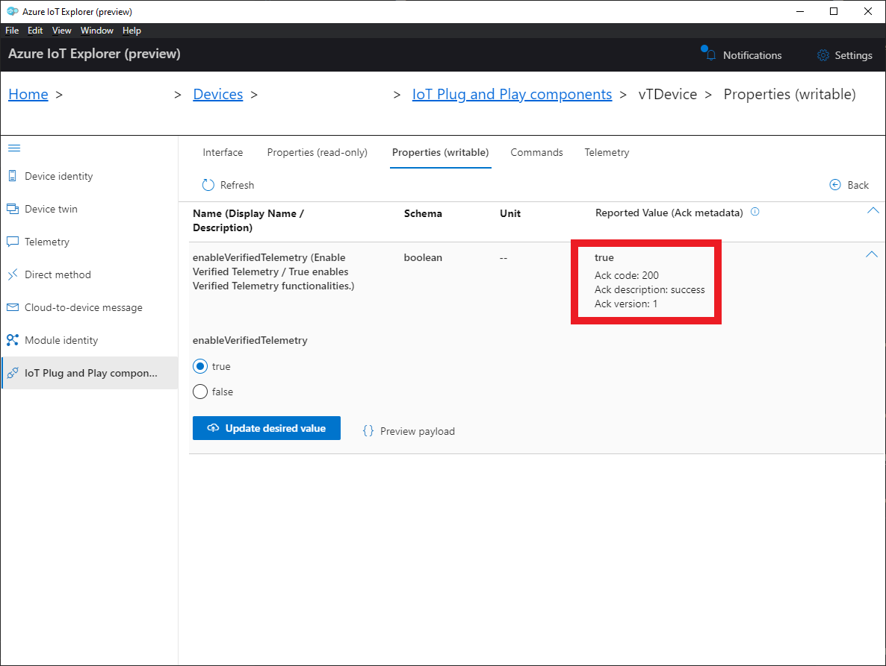

# Setup Verified Telemetry and consume Verified Telemetry information using Azure IoT Explorer 
## Table of Contents

* [Steps to setup Verified Telemetry](https://github.com/Azure/Verified-Telemetry-Device-Sample/blob/main/docs/vTIoTExplorerSample.md#steps-to-setup-verified-telemetry)
* [Consuming Verified Telemetry Information ](https://github.com/Azure/Verified-Telemetry-Device-Sample/blob/main/docs/vTIoTExplorerSample.md#consuming-verified-telemetry-information)
## Steps to setup Verified Telemetry

### Complete one of the board specific device samples: 
* MXCHIP: 
  * [AZ3166](../MXChip/AZ3166)
* STMicroelectronics:
  * [B-L475E-IOT01A](../STMicroelectronics/STM32L4_L4+)
  * [B-L4S5I-IOT01A](../STMicroelectronics/STM32L4_L4+)

### Setup Azure IoT Hub details in Azure IoT Explorer

To add a connection to your IoT hub:

1. In your CLI console, run the [az iot hub show-connection-string](https://docs.microsoft.com/en-us/cli/azure/iot/hub?view=azure-cli-latest#az-iot-hub-show-connection-string) command to get the connection string for your IoT hub.

    ```shell
    az iot hub show-connection-string --name {YourIoTHubName}
    ```

1. Copy the connection string without the surrounding quotation characters.
1. In Azure IoT Explorer, select **IoT hubs > Add connection**.
1. Paste the connection string into the **Connection string** box.
1. Select **Save**.

    

If the connection succeeds, the Azure IoT Explorer switches to a **Devices** view and lists your device.

### Add PnP Model Files  

To add a device model to IoT Explorer:

1. Navigate to **Home**.
1. Select **IoT Plug and Play Settings**.
1. Select **Add > Local folder**.
1. Select **Pick a folder**.
1. Browse to */verified-telemetry-device-sample/core/model/*. The folder contains the Verified Telemetry Interface and sample model files.
1. Click **Select**.
1. Select **Save**.

    

### Access the IoT Plug and Play components 

To access the IoT Plug and Play components on your device:

1. Select **IoT hubs > View devices in this hub**.
1. Select your device.
1. Select **IoT Plug and Play components**.

    

### Enable Verified Telemetry
* Navigate to vTDevice Component -> Properties (writable)
* The `enableVerifiedTelemetry` property should be set to true by default. 
    
* However, if it is false or there is a blank field, update the `enableVerifiedTelemetry` property to true

    

### Collect Fingerprint Template for telemetry soilMoistureExternal1
* Navigate to vTsoilMoistureExternal1 Component -> Commands 
* Issue command `setResetFingerprintTemplate` in the vTsoilMoistureExternal1 component for setting up Verified Telemetry for the telemetry named 'soilMoistureExternal1'

    

### Collect Fingerprint Template for telemetry soilMoistureExternal2
* Navigate to vTsoilMoistureExternal2 Component -> Commands 
* Issue command `setResetFingerprintTemplate` in the vTsoilMoistureExternal2 component for setting up Verified Telemetry for the telemetry named 'soilMoistureExternal2'

    

## Consuming Verified Telemetry Information  
* Navigate to vTDevice Component -> Properties (read-only)
* Click on Refresh
* The property `deviceStatus` indicates whether all the telemetries supported by Verified Telemetry are verified or not

    

* Navigate to vTsoilMoistureExternal1 Component -> Properties (read-only)
* Click on Refresh
* The property `telemetryStatus` in the vTsoilMoistureExternal1 component indicates whether the telemetry'soilMoistureExternal1' is verified or not

    

* Navigate to vTsoilMoistureExternal2 Component -> Properties (read-only)
* Click on Refresh
* The property `telemetryStatus` in the vTsoilMoistureExternal2 component indicates whether the telemetry'soilMoistureExternal2' is verified or not

    

* In case of fault with the Soil Moisture Sensor 1, the property `telemetryStatus` in the vTsoilMoistureExternal1 component would be false indicating that the telemetry'soilMoistureExternal1' has a FAULT and should not be consumed by upstream processes
    > NOTE: To simulate a faulty sensor, just disconnect Soil Moisture Sensor 1 which would create an Open Port fault!
   
    

## Next Steps
* With this sample, you have now setup and interacted with a Verified Telemetry device sample
* To see how a solution sample can utilise Verified Telemetry Data, refer to our [Custom Solution Sample](https://github.com/Azure/Verified-Telemetry-Solution-Sample) which uses a Grafana Dashboard
* To understand how to modify your existing IoT solution to utilize Verified Telemetry Information, refer to the following documentation - 
    * [Fetching Verified Telemetry Information for your Custom Solution](https://github.com/Azure/Verified-Telemetry-Solution-Sample/blob/main/docs/customSolution.md) 
* For steps to include Verified Telemetry in your existing solution, refer to documentation in the [Verified Telemetry Library](https://github.com/Azure/Verified-Telemetry)