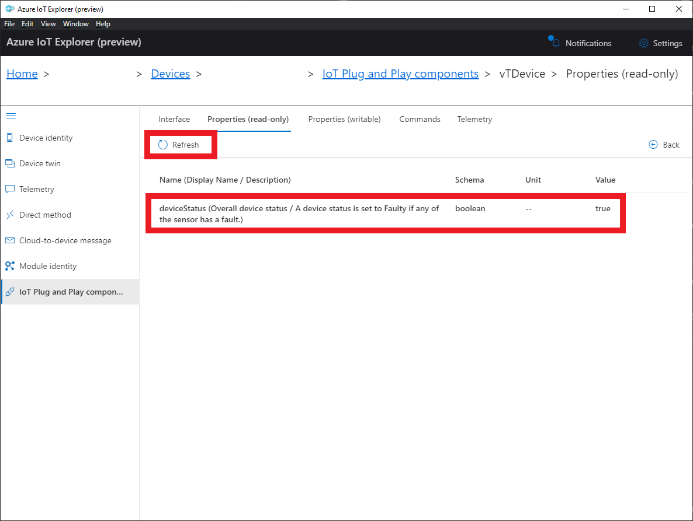

# Setup Verified Telemetry and consume Verified Telemetry information using Azure IoT Explorer 
## Table of Contents

* [Steps to setup Verified Telemetry](https://github.com/Azure/Verified-Telemetry-Device-Sample/MXChip/AZ3166#prerequisites)
* [Consuming Verified Telemetry Information ](https://github.com/Azure/Verified-Telemetry-Device-Sample/MXChip/AZ3166#prepare-the-development-environment)
## Steps to setup Verified Telemetry

### Complete one of the board specific device samples: 
* MXCHIP: 
  * [AZ3166](../MXChip/AZ3166)
* STMicroelectronics:
  * [B-L475E-IOT01A](../STMicroelectronics/STM32L4_L4+)
  * [B-L4S5I-IOT01A](../STMicroelectronics/STM32L4_L4+)

### Setup Azure IoT Hub details in Azure IoT Explorer

To add a connection to your IoT hub:

1. In your CLI console, run the [az iot hub show-connection-string](https://docs.microsoft.com/en-us/cli/azure/iot/hub?view=azure-cli-latest#az-iot-hub-show-connection-string) command to get the connection string for your IoT hub.

    ```shell
    az iot hub show-connection-string --name {YourIoTHubName}
    ```

1. Copy the connection string without the surrounding quotation characters.
1. In Azure IoT Explorer, select **IoT hubs > Add connection**.
1. Paste the connection string into the **Connection string** box.
1. Select **Save**.

    

If the connection succeeds, the Azure IoT Explorer switches to a **Devices** view and lists your device.

### Add PnP Model Files  

To add a device model to IoT Explorer:

1. Navigate to **Home**.
1. Select **IoT Plug and Play Settings**.
1. Select **Add > Local folder**.
1. Select **Pick a folder**.
1. Browse to */verified-telemetry-device-sample/core/model/*. The folder contains the Verified Telemetry Interface and sample model files.
1. Click **Select**.
1. Select **Save**.

    

### Access the IoT Plug and Play components 

To access the IoT Plug and Play components on your device:

1. Select **IoT hubs > View devices in this hub**.
1. Select your device.
1. Select **IoT Plug and Play components**.

    

### Enable Verified Telemetry
* Ensure `enableVerifiedTelemetry` from the root/default component is true

    

### Collect Fingerprint Template for telemetry soilMoistureExternal
* Issue command `setResetFingerprintTemplate` in the vTsoilMoistureExternal component for setting up Verified Telemetry for the telemetry named 'soilMoistureExternal'

    

### Collect Fingerprint Template for telemetry accelerometerXExternal
* Issue command `setResetFingerprintTemplate` in the vTaccelerometerXExternal component for setting up Verified Telemetry for the telemetry named 'accelerometerXExternal'

    

## Consuming Verified Telemetry Information  
* The property `deviceStatus` from the root/default component indicates whether all the telemetries supported by Verified Telemetry are verified or not

    

* The property `telemetryStatus` in the vTsoilMoistureExternal component indicates whether the telemetry'soilMoistureExternal' is verified or not

    

* The property `telemetryStatus` in the vTaccelerometerXExternal component indicates whether the telemetry'accelerometerXExternal' is verified or not

    

* In case of fault with the Soil Moisture sensor, the property `telemetryStatus` in the vTsoilMoistureExternal component would be false indicating that the telemetry'soilMoistureExternal' has a FAULT and should not be consumed by upstream processes
   
    